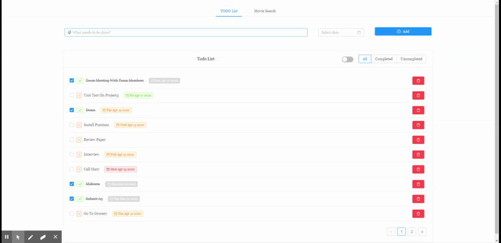
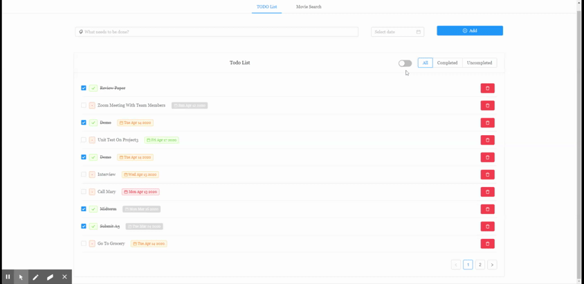
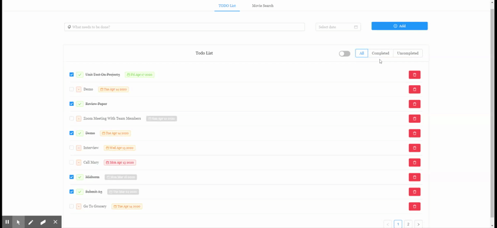
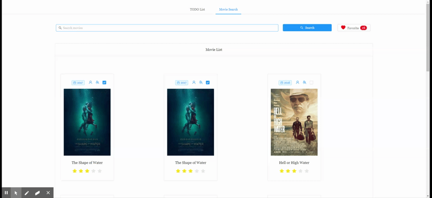
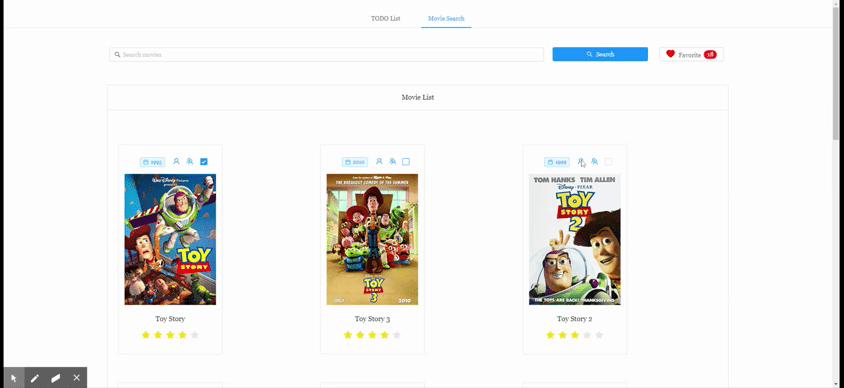
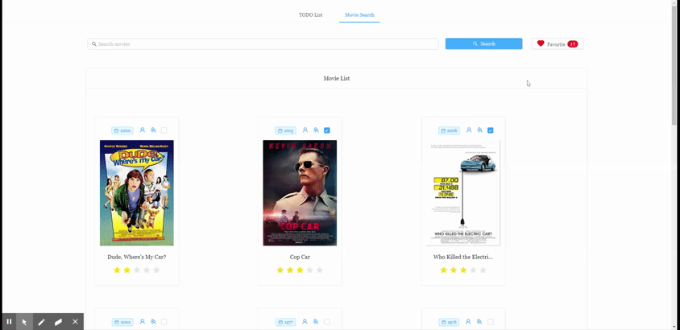

# MovieSearch-ToDoList
SPA web app using React/Redux/Redux-Saga (Ant Design Umi/Dva framework).

## Quick Start
```
git clone git@github.com:ya-gao/MovieSearch-ToDoList.git
npm install
npm start
```
Open your browser and visit [http://localhost:8000](http://localhost:8000)

## Demo
### ToDoList Demo
Add, toggle and delete todo items<br/>
<br/>
Sort by due date or by update time<br/>
<br/>
Filter by completed/uncompleted/all todo items<br/>
<br/>
### Movie Search Demo
Search movies by title<br/>
<br/>
View movie details and add to favorite/remove from favorite<br/>
<br/>
Toggle movies in your favorite list<br/>
<br/>
